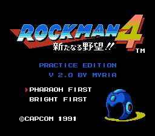
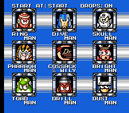
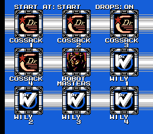

# Rockman 4 / Mega Man 4 Practice ROM Hack
This is a ROM hack to assist with practicing speedruns of Rockman 4.
It allows selecting any stage, and gives you the items for the stage according to the route.
It also times each section of the game so that you can see how you're doing.

  

 

## How to Install
Apply the patch Rockman4Practice_v2.0.ips from a "Release" to a copy of a Rockman 4 (J) ROM file.

## Features
 * When you choose a stage, you will have the weapons according to the speedrun route.
 * A timer shows how long you took completing a section of the game: one screen transition or boss kill.
 * Supports two routes: Pharaoh Man first and Bright Man first.  This is the following order:
   1. Pharaoh Man plus balloon, or Bright Man
   1. The other of those two
   1. Ring Man
   1. Dust Man
   1. Skull Man
   1. Dive Man
   1. Drill Man
   1. Toad Man
 * Choose "COSSACK & WILY" in the center to select a castle level.
 * Level exit: bring up the pause menu and press SELECT.
 * Completing Wily 4 returns to stage select instead of playing the ending.
 * Press SELECT on the stage select screen to choose whether to begin levels at the start, at the midpoint, or in the corridor before the boss.
 * Press B on the stage select screen to disable or re-enable item drops from enemies.
 * Stage and castle intros are deleted.
 * Infinite lives and infinite E-tanks.
 * Fun: The title screen plays the full title screen music instead of cutting it off.

## Timer
 * Completing a segment shows a timer in the upper right of the form seconds'frames.  Frames are counted 00-59.
 * The timer shows upon the following:
   * Screen transitions.
   * Teleporting following a boss kill.
     * This way, not doing the trick in the middle of the screen will count against you.
   * Collecting the Balloon item.
   * After defeating Dr. Cossack, when Blues (Proto Man) is about to teleport in.
     * This way, the time it takes for Rockman to move left and Dr. Cossack to move right is counted.
   * Entering a teleporter in Wily 3, both before and after a boss.

## Midpoints
 * Start/Mid/Boss midpoints work like you expect for robot masters.
   * "Mid" or "Boss" on Pharaoh Man will give you the Balloon.
   * "Mid" on Dust Man deletes Eddie to fix a bug in the original game.
 * For most castle stages, a "boss" midpoint is added that was not in the original game.
 * "Mid" on Wily 3 takes you to the refight teleporter room with none defeated.
 * "Boss" on Wily 3 also takes you there, but enables the Wily Machine teleporter.
 * "Boss" on Wily 4 takes you to the final screen before the Wily Capsule fight.

## Known Issues
 * The practice hack is a different mapper, 119, compared to the original's 4.  This causes some compatibility issues.
   * Loading saved states on EverDrive often corrupts graphics.
 * The Wily Capsule timer shows when Rockman starts walking to the left after the final hit, rather than immediately upon the last hit.

## Credits
 * Pinkus for the [Rockman 3 Practice Hack](https://github.com/helgefmi/mm3hack) source.
 * becored for the [Rockman 6 Practice Hack](https://github.com/becored/RM6_Prac) source.
 * Chelney for a lot of suggestions and testing.
